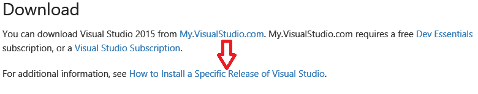
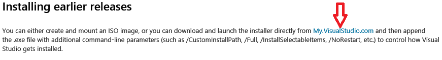
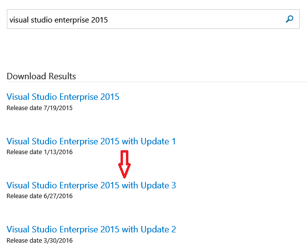
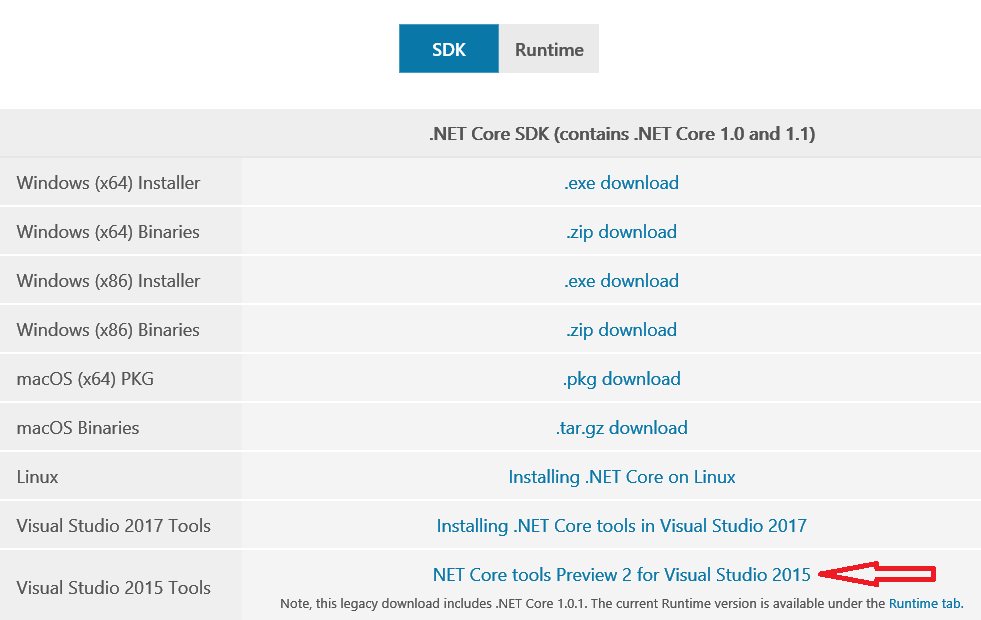

OneNote service API ASP.NET core sample
---------------------------------------

Created by Microsoft Corporation, 2017. Provided As-is without warranty. Trademarks mentioned here are the property of their owners.

DEMO: https://onenoteapisamplegraph.azurewebsites.net

### Intro

-	This is a small sample that shows how to use access OneNote resources via the Microsoft Graph API from an ASP.NET server.
-	Currently, the Microsoft Graph OneNote endpoints do not support authorized requests via a Microsoft (Live ID) account, so to use this sample, you must be authenticated via an Azure Active Directory (work/school) account.

### Prerequisites

**Tools and Libraries** you will need to download, install, and configure for your development environment

* [Visual Studio 2015 Update 3](https://www.visualstudio.com/en-us/news/releasenotes/vs2015-update3-vs) 
  1. Click on “How to Install a Specific Release of Visual Studio”: 
  
  

  2. Click on “My.VisualStudio.com”: 
  
  

  3. [Download Visual Studio Enterprise 2015 with Update 3](https://my.visualstudio.com/downloads?q=visual%20studio%20enterprise%202015) (logged in with a MSFT account) 
  
  

* [ASP.NET Core SDK (For .NET Core 1.0)](https://www.microsoft.com/net/download/core)

* [Visual Studio 2015 Tools](https://www.microsoft.com/net/download/core)
  1. Install Visual Studio 2015 tools. 
  
  

### Using the sample

After you've set up your development tools, and installed the prerequisites listed above,...

1.	Download the repository as a ZIP file to your local computer, and extract the files. Or, clone the repository into a local copy of Git.
2.	Open the project (.sln file) in Visual Studio.
3.	It is highly recommended that you get your own client ID, secret and redirect uri and copy it into [Config.cs](https://github.com/OneNoteDev/OneNoteApiSampleAspNetCore/blob/master/src/OneNoteApiSample/Config.cs#L9). You can get your own appid, app secret and redirect uri [here](http://developer.microsoft.com/en-us/graph/docs/authorization/auth_register_app_v2)
4.	For local development, the sample uses https://localhost:5001/msaoauthcallback as a redirect URI. For production, you should change this to point to your application's domain. >Note: Chrome and Firefox do not allow cookies to be set on localhost, and thus authentication will not work on these browsers during development if you choose to redirect to localhost.
5.	Make sure you have selected the "OneNoteApiSample" configuration when launching the app locally. See [screenshot](https://github.com/OneNoteDev/OneNoteApiSampleAspNetCore/blob/master/images/OneNoteApiSampleConfiguration.PNG).
6.	Build and run the application (F5)

### Content

You can find additional documentation at the links below.

-	Create Pages:
	-	[POST simple HTML to a new OneNote Quick Notes page](https://developer.microsoft.com/en-us/graph/docs/api-reference/beta/api/notes_post_pages)
-	Query and Search Pages:
	-	[GET a paginated list of all pages in OneNote](https://developer.microsoft.com/en-us/graph/docs/api-reference/beta/api/notes_list_pages)
-	Manage Notebooks and Sections:
	-	[GET a list of all notebooks](https://developer.microsoft.com/en-us/graph/docs/api-reference/beta/api/notes_list_notebooks)
	-	[GET a list of all sections](https://developer.microsoft.com/en-us/graph/docs/api-reference/beta/api/notes_list_sections)

#### Note

As a sample, and for simplicity, this sample does not follow best practices for an application in Production. If you intent to ship this code, we recommend doing the following:

-	Never check in app secrets to your repository
-	Require HTTPS throughout your site
-	Don't store unencrypted refresh tokens in cookies

-	**NuGet packages** used in the sample. These are handled using the package manager, as described in the setup instructions. These should update automatically at build time; if not, make sure your NuGet package manager is up-to-date. You can learn more about the packages we used at the links below.

	-	[Newtonsoft Json.NET package](http://newtonsoft.com/) provides Json parsing utilities.
	-	Other Nuget packages from Microsoft, listed in project.json

### Version Info

| Date         | Change                                                |
|--------------|-------------------------------------------------------|
| March 2017   | Updated to utilize the Microsoft Graph API endpoints. |
| January 2017 | Initial public release for this code sample.          |

### Learning More

-	Visit the [dev.onenote.com](http://dev.onenote.com) Dev Center
-	Contact us on [StackOverflow (tagged OneNote)](http://go.microsoft.com/fwlink/?LinkID=390182)
-	Follow us on [Twitter @onenotedev](http://www.twitter.com/onenotedev)
-	Read our [OneNote Developer blog](http://go.microsoft.com/fwlink/?LinkID=390183)
-	Explore the API using the [Graph Explorer](https://developer.microsoft.com/en-us/graph/graph-explorer)
-	[API Reference](https://developer.microsoft.com/en-us/graph/docs/api-reference/beta/resources/notes) documentation
-	[Known Issues](https://developer.microsoft.com/en-us/graph/docs/overview/release_notes)
-	[Getting Started](https://developer.microsoft.com/en-us/graph/docs/get-started/get-started) with the Microsoft Graph API

This project has adopted the [Microsoft Open Source Code of Conduct](https://opensource.microsoft.com/codeofconduct/). For more information see the [Code of Conduct FAQ](https://opensource.microsoft.com/codeofconduct/faq/) or contact [opencode@microsoft.com](mailto:opencode@microsoft.com) with any additional questions or comments.
